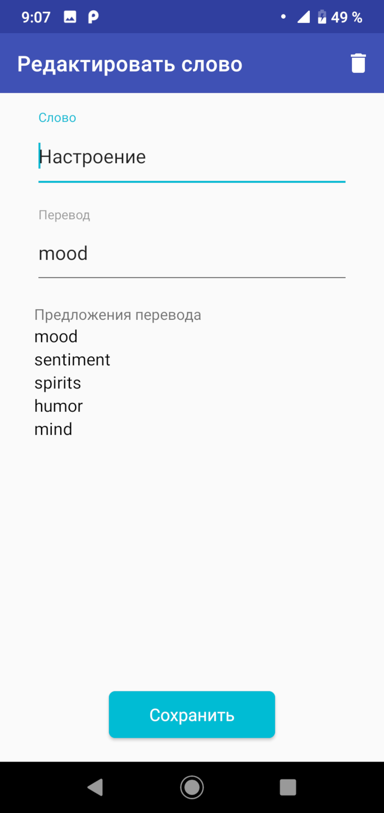

# Тестовое задание для компании "Билинговые системы"   
  Приложение для взамодействия с Yandex.Dictionary API. На данный момент поддерживается только перевод с русского на английский.   
   
   
   

# Используемые технологии
 * Dagger 2
 * RxJava 2
 * Retrofit
 * Room
 * Android Architecture Components (ViewModel, Navigation)
